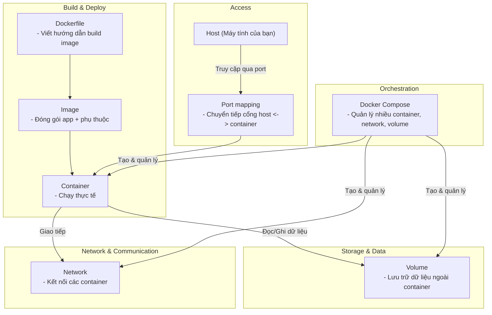

# Sơ đồ tư duy Docker cơ bản

---

## Giải thích từng phần

- **Dockerfile**: Viết hướng dẫn build image cho app.
- **Image**: Được build từ Dockerfile, chứa app và các phụ thuộc.
- **Container**: Instance của image, chạy thực tế.
- **Volume**: Lưu trữ dữ liệu ngoài container, tránh mất khi container bị xóa.
- **Network**: Kết nối các container, giúp chúng giao tiếp với nhau.
- **Port mapping**: Chuyển tiếp cổng từ máy host vào container để truy cập dịch vụ.
- **Docker Compose**: Quản lý nhiều container, network, volume cùng lúc, giúp triển khai hệ thống phức tạp dễ dàng.

Bạn có thể copy sơ đồ Mermaid này vào [Mermaid Live Editor](https://mermaid-js.github.io/mermaid-live-editor/) hoặc dùng extension Mermaid trong VS Code để xem hình ảnh trực quan.
